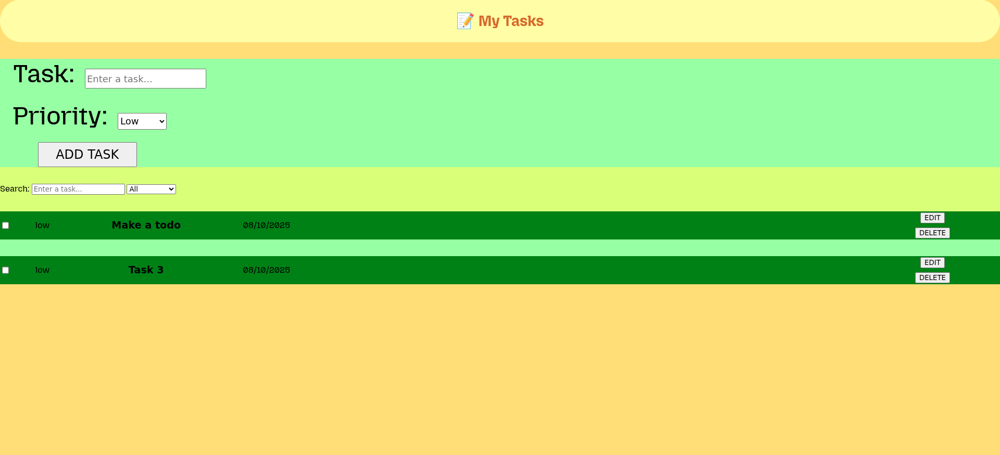

# 📝 ToDo Pro

A simple yet powerful ToDo application with **task management**, **priority system**, **search**, and **local storage** support.  
Designed for quick task tracking and improved productivity.

## 🚀 Features

- Add, edit, and delete tasks
- Priority levels: Low, Medium, High
- Mark tasks as completed
- Search tasks by title
- Filter tasks (All, Active, Completed)
- Persistent data storage using `localStorage`
- Responsive design for mobile and desktop

## 📸 Screenshot



## 🛠️ Technologies Used

- HTML5
- CSS3
- JavaScript (Vanilla)
- LocalStorage API

## 📂 How to Run Locally

1. Clone the repository:
   ```bash
   git clone https://github.com/yourusername/todo-pro.git

2. Open the folder in your code editor.

3. Open index.html in your browser.

## 🌍 Live Demo

[link](https://yari4ek89.github.io/todopro-site/)

## 📌 License

This project is licensed under the MIT License.